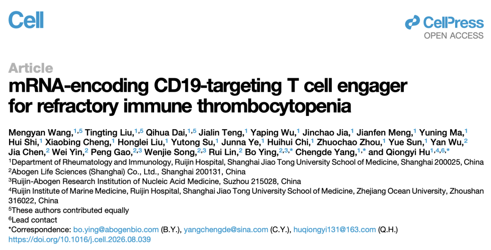
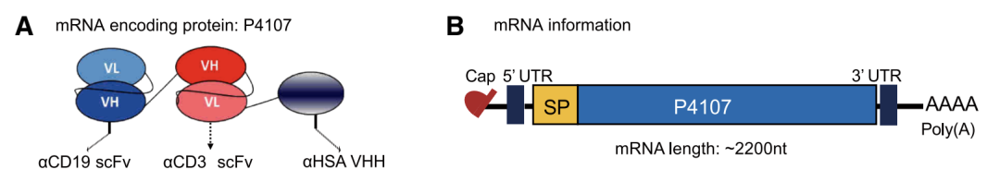
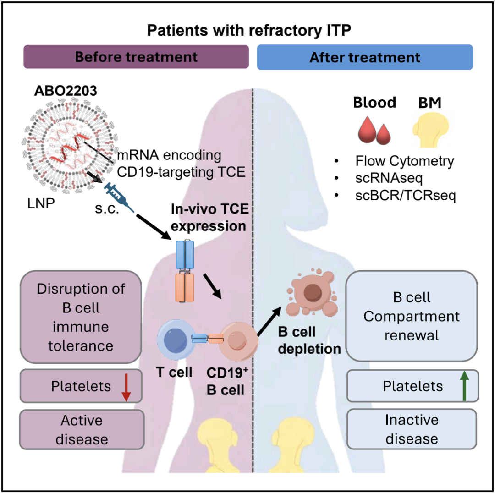

# 原文存档｜艾博登上Cell：mRNA体内编码CD19×CD3 TCE，3例难治性自免患者实现完全B细胞耗竭

> **存档说明**：本文件据本人提供的 Word 版推文逐段照录，文字无 OCR 误差；配图按原文位置插入。页首广告图未收录，以文字注明。分析与解读见同目录 `README.md`。

| 项目 | 内容 |
|---|---|
| 公众号 | RNAScript（撰文：生物世界；编辑、排版：RNAScript） |
| 发布日期 | 2026-09-19 |
| 原文链接 | https://mp.weixin.qq.com/s/tWGFqhsg0Tg-z3ScTqB_bQ |
| 导师分享时间 | 2026-09-19 22:19（中国时间）／ 15:19（英国时间） |
| 提供人 | 李晓林教授（朋友圈 · AI for Life Science） |
| 存档时间 | 2026-09-25 |

> 〔页首广告：近岸蛋白（Novoprotein）「系列创新 mRNA 原液质控试剂盒，加速产品申报」——创新 mRNA 加帽率快速检测试剂盒（发明专利：ZL 2023 1 1212061 X）；NovoFast dsRNA ELISA Kit（1.5 小时完成 dsRNA 杂质检测）〕

---

免疫性血小板减少症（ITP）是一种危及生命的自身免疫疾病，与出血风险增加相关。该病分为原发性和继发性两种类型，其中继发性 ITP 常与系统性红斑狼疮（SLE）、干燥综合征（SS）和抗磷脂综合征（APS）相关。ITP 的特征是血小板清除加速和巨核细胞生成受损，主要由对血小板自身抗原的免疫耐受丧失所驱动。仅有 20%-40% 的患者在逐渐减量使用糖皮质激素后仍能维持疗效。相当一部分患者在接受其他治疗（例如血小板生成素受体激动剂、利妥昔单抗、BTK 抑制剂或脾切除术）时，仍无法达到充分缓解。

近年来，自身免疫疾病治疗领域的创新已转向强效的免疫调控策略，例如 CAR-T 细胞疗法和 T 细胞衔接器（T cell engager，TCE）。然而，CAR-T 细胞疗法受到复杂制造流程、较长的生产周期、需要淋巴耗竭预处理，存在细胞因子释放综合征（CRS）、免疫效应细胞相关神经毒性综合征（ICANS）等副作用，以及基因组整合或插入带来潜在突变风险的限制。而基于蛋白质的 TCE 需要逐步递增剂量以减轻 CRS 风险，从而增加了临床操作的复杂性。此外，TCE 还存在免疫原性的风险。

相比之下，基于 mRNA 的 TCE，可实现渐进性的全身暴露，避免了与高最大浓度（Cmax）相关的毒性，例如细胞因子释放综合征（CRS）。此外，内源性表达的 TCE 可能降低免疫原性风险。总体而言，mRNA 编码 TCE 平台凭借更高的安全性、给药便捷性以及对深层组织的良好渗透能力，成为"重启"难治性自身免疫疾病患者免疫系统的有力策略。

2026 年 9月 18 日，上海交通大学医学院附属瑞金医院胡琼依教授、杨程德教授及艾博生物 CEO 英博博士作为共同通讯作者（王孟燕、刘婷婷、戴启华为论文共同第一作者），在国际顶尖学术期刊 Cell 上发表了题为：mRNA-encoding CD19-targeting T cell engager for refractory immune thrombocytopenia 的研究论文。

该论文报道了 LNP 递送的编码 CD19×CD3 TCE 的 mRNA 药物 ABO2203 的研发与首次人体研究（first in human）结果，创新性的 mRNA 体内编码 TCE 蛋白的产品应用于难治性继发性免疫性血小板减少症（ITP）， 为自身免疫疾病领域提供了全新治疗范式。

尽管 T 细胞衔接器（TCE）和 CAR-T 细胞疗法在 B 细胞耗竭方面展现出临床前景，但在安全性、有效性和持久性方面仍面临挑战。

ABO2203 是由艾博生物开发的一种采用脂质纳米颗粒（LNP）递送的 mRNA 产品，可编码 CD19×CD3 TCE。在这项针对 3 名难治性继发性免疫性血小板减少症（ITP）患者的小型临床研究中，ABO2203 实现了外周血和骨髓中 CD19+ B 细胞的快速且完全清除，达到完全的血小板反应，并表现出良好的安全性。

该论文详细阐述了 ABO2203 的开发进展，将临床前数据与首次首次人体研究（first in human）结果进行了桥接。

具体来说，ABO2203 是一种基于 mRNA 的治疗药物，编码多特异性 T 细胞衔接器——P4107，用于 B 细胞耗竭。P4107 蛋白分子量仅为约 67 kDa，采用三功能结构域设计——抗 CD19 scFv（精准靶向 B 细胞）、抗 CD3 scFv（接合并激活 T 细胞）以及抗人血清白蛋白重链可变区（延长半衰期）。此外，为了提升 mRNA 的翻译效率和转录稳定性，研究团队采用了密码子优化、核苷酸修饰和非翻译区工程化改造。该 mRNA 封装于专有 LNP 制剂中，此递送系统具有高递送效率和良好的安全性。

研究团队证实，在转基因小鼠中，与 TCE 蛋白相比，ABO2203 诱导了完全的 B 细胞耗竭，并且细胞因子释放程度较低。

研究团队进一步开展了一项针对三名难治性继发性免疫性血小板减少症（ITP）患者开展的首次人体研究（first in human），患者 1（35 岁女性）为系统性红斑狼疮继发性 ITP；患者 2 （46 岁女性）为干燥综合征继发性 ITP；患者 3（48 岁女性）为抗磷脂综合征继发性 ITP。

结果显示，ABO2203 实现了快速且完全的外周 B 细胞耗竭，并在骨髓中维持了持续的耗竭效果。患者在随访 6 个月期间表现出持久的血小板恢复、血清学指标改善以及疾病活动度降低。ABO2203 耐受性良好，仅出现 1 级和 2 级不良事件，未发生细胞因子释放综合征（CRS），该研究还观察到了患者的 B 细胞重建，以过渡期和初始 B 细胞为主。

该研究的亮点总结：

- ABO2203 是一种编码 CD19×CD3 TCE 的 mRNA-LNP，用于耗竭 B 细胞；
- ABO2203 在小鼠中可诱导完全的 B 细胞耗竭，并伴有减弱的细胞因子释放；
- ABO2203 在 3 名难治性 ITP 患者中实现了快速、完全的 B 细胞清除；
- 所有 3 名患者均表现出持久的血小板恢复，且未出现严重毒性反应。

总的来说，这些结果证实，mRNA 编码的 TCE 是一种针对 B 细胞介导的自身免疫疾病更有效且更安全的治疗手段。

总的来说，这项研究首次在人体中验证了"mRNA 体内编码 TCE"这一全新治疗模态，与 CAR-T 细胞疗法相比，ABO2203 只需 μg 级剂量的皮下注射，即可实现相当的 B 细胞清除深度，且恢复过程更可控；与蛋白类 TCE 相比，ABO2203 半衰期延长至 7-11 天，可实现骨髓、淋巴等深层组织清除而无需复杂、长期的剂量递增给药。这项在难治性继发性 ITP 患者中完成的概念验证，证实了 mRNA 编码的 TCE 是一种针对 B 细胞介导的自身免疫疾病更有效且更安全的治疗手段。

**参考资料**

https://www.cell.com/cell/fulltext/S0092-8674(26)01012-3

---

*存档整理：Claude Code · 2026-09-25（原文"首次首次人体研究"为推文原有重复字，照录未改）*
